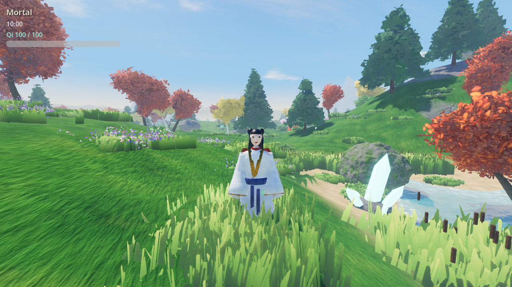
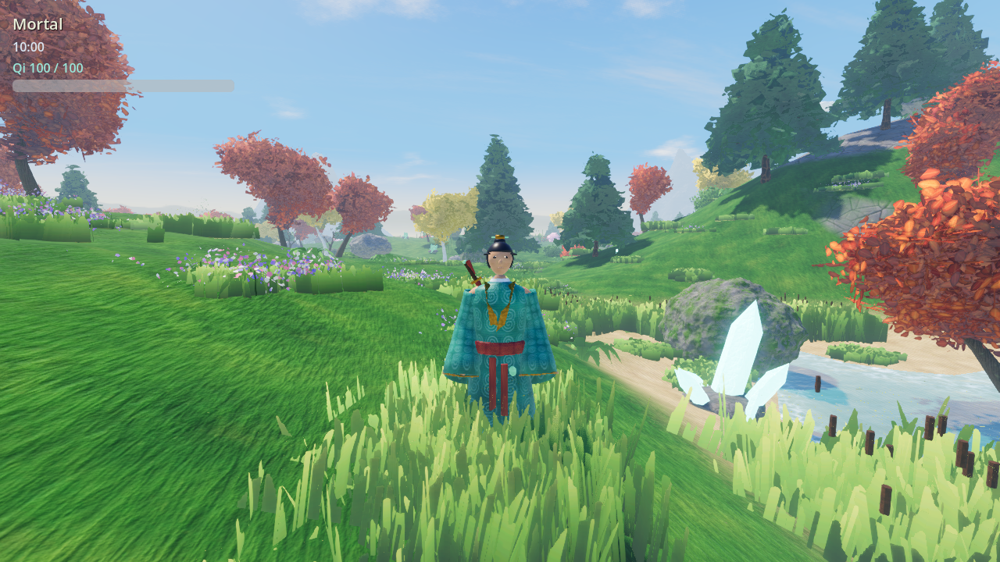
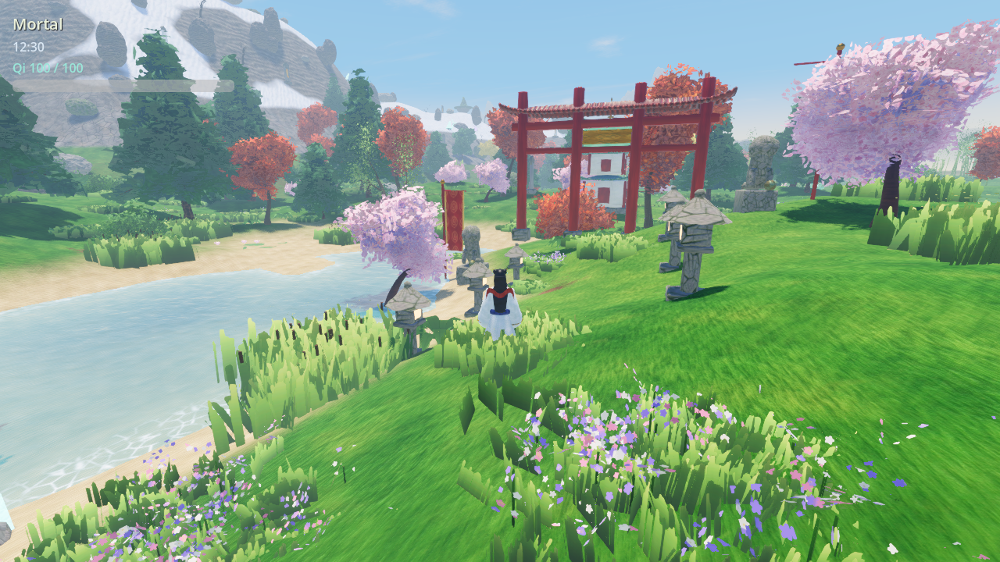
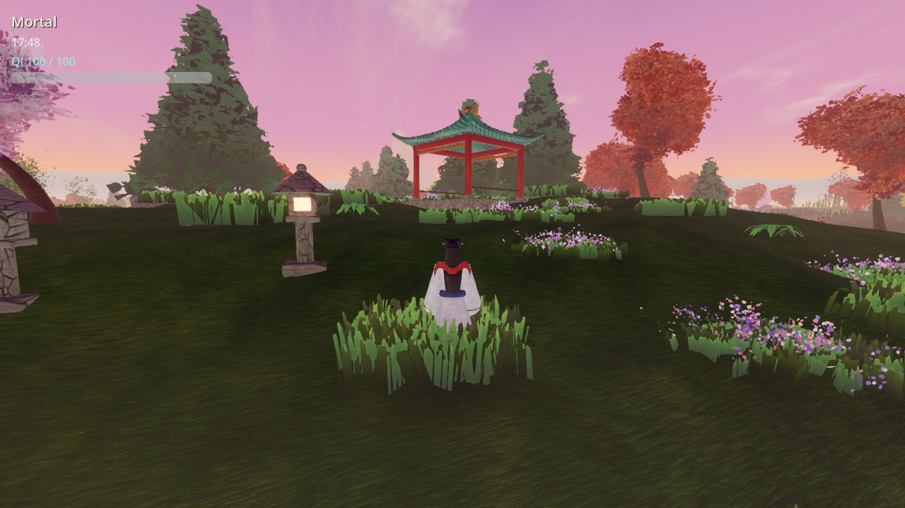
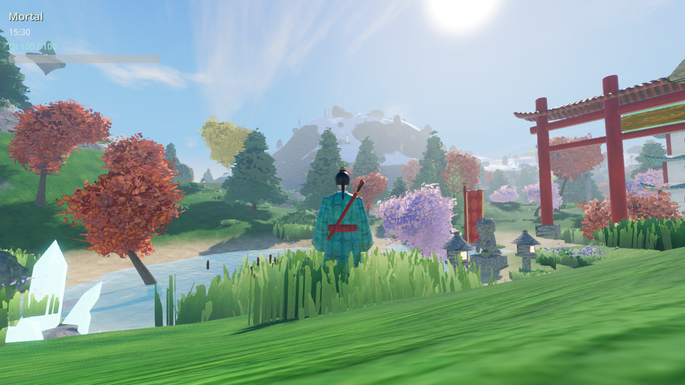
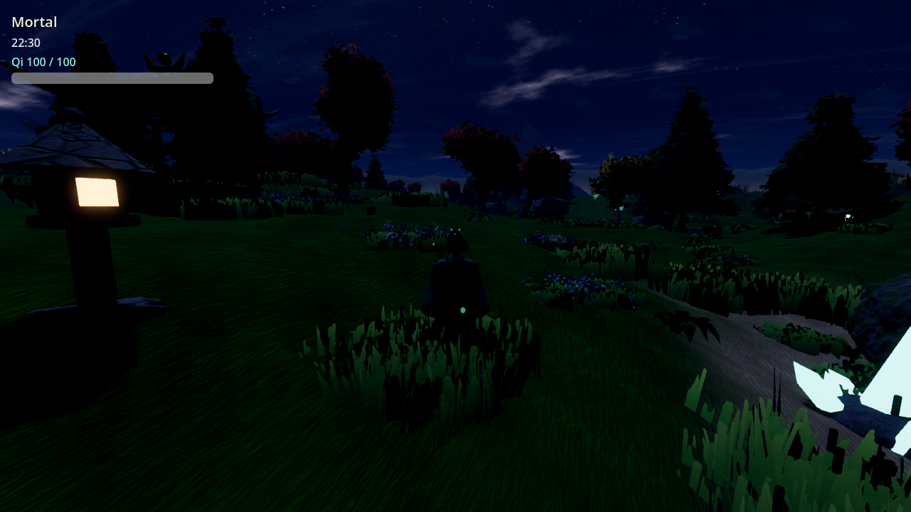
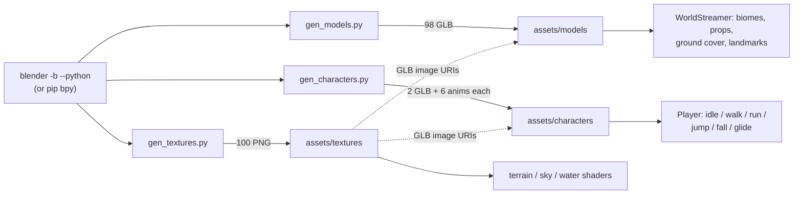

# xianxiago

3D open world game using Godot and Blender, Xianxia theme. Built to keep
expanding the explorable map over time.

## Status

Milestone 1 (exploration + movement core) is in place: a third-person
cultivator controller with sprint, jump, and a qinggong (light-body) air-leap
+ glide, all powered by a qi resource, walking on procedurally streamed
open-world terrain with a day/night cycle.

All art is generated with headless Blender scripts: 100 textures, 98
world models and two rigged, animated cultivator characters (male and
female). The terrain is splatted with those textures by height, slope and
biome, and the sky is a painted shader with clouds, mountain silhouettes,
dusk colours and stars. See `docs/DESIGN.md` for how it's built and
`docs/ROADMAP.md` for what's next.

| | |
|---|---|
|  |  |
|  |  |
|  |  |

## Running it

Open the project folder in **Godot 4.7+** (`project.godot` at the repo root)
and run the main scene (`scenes/main/World.tscn`), or from the command line.

On a fresh clone, import the assets once first. The `.godot/` import cache is
gitignored, so the `.glb` models under `assets/models/` have no imported
`.scn` files yet, and running the scene directly won't create them:

```sh
godot --headless --path . --import   # first run, or after adding/changing assets
godot --path . scenes/main/World.tscn
```

Opening the project in the editor also imports everything, so this step is
only needed when you launch straight from the command line.

### Troubleshooting

If launching prints `Cannot open file 'res://.godot/imported/<model>.glb-….scn'`
followed by `Could not preload resource file` in `world_streamer.gd` and
`Nonexistent function 'set_target' in base 'Node3D'`, the import cache is
missing or stale. Run the `--import` command above and try again. (The
`set_target` error comes from the same problem: `world_streamer.gd` fails to
parse, so its node falls back to a plain `Node3D`.)

### Controls

| Action | Key |
|---|---|
| Move | WASD |
| Look | Mouse |
| Jump / qinggong air-leap | Space |
| Sprint | Shift (held) |
| Light-body glide | Ctrl (held, while falling) |
| Switch cultivator (male / female) | C |
| Toggle mouse capture | Esc |

## Project layout

```
project.godot          Godot project config, input map, autoloads
scenes/                .tscn scene files (main/, player/, world/, ui/)
scripts/               GDScript sources, mirrored by folder (systems/, player/, world/, ui/)
resources/             Environment, shaders (terrain, sky, water), materials
assets/textures/       100 Blender-baked PNG textures (shared by everything)
assets/models/         98 Blender-generated .glb world models
assets/characters/     Rigged + animated male/female cultivators (.glb)
tools/blender/         Headless-Blender generators for all of the above
docs/                  DESIGN.md (architecture) and ROADMAP.md (what's next)
```

## Art pipeline (headless Blender)



The models reference the shared PNGs by relative URI instead of embedding
copies, so each texture is imported only once. Regenerate with:

```sh
python3.11 -m pip install bpy==4.5.4          # or use a Blender 4.5 binary: blender -b --python ...
python3.11 tools/blender/gen_textures.py
python3.11 tools/blender/gen_models.py        # add --preview DIR for thumbnails
python3.11 tools/blender/gen_characters.py
godot --headless --path . --import
```
