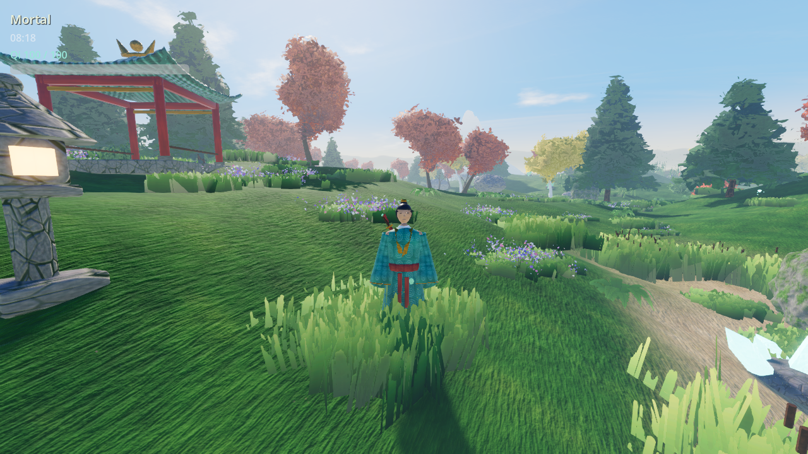

# xianxiago

3D open world game using Godot and Blender, Xianxia theme. Built to keep
expanding the explorable map over time.

## Status



Milestone 1 (exploration + movement core) is in place: a third-person
cultivator controller with sprint, jump, and a qinggong (light-body) air-leap
+ glide, all powered by a qi resource, walking on procedurally streamed
open-world terrain with a day/night cycle. See `docs/DESIGN.md` for how it's
built and `docs/ROADMAP.md` for what's next.

## Running it

Open the project folder in **Godot 4.7+** (`project.godot` at the repo root)
and run the main scene (`scenes/main/World.tscn`), or from the command line:

```sh
cd xianxiago
godot4 --headless --path . --import          # first run only, see note below
godot4 --path . scenes/main/World.tscn
```

The `--import` pass is only needed once per fresh checkout (it builds the
`.godot/` cache — Godot's global script class registry plus the imported
`.glb` props — which is gitignored and doesn't exist yet right after a
clone). Skipping it and running the scene directly on a brand-new checkout
fails with `Could not find type "..." in the current scope` /
`Cannot open file '.godot/imported/...'` errors, since neither exists yet.
Once you've opened the project in the editor or run `--import` at least
once, plain `godot4 --path . scenes/main/World.tscn` is enough from then
on. This mirrors what `.github/workflows/godot-ci.yml` does: it always
runs `--import` before running the scene.

### Controls

| Action | Key |
|---|---|
| Move | WASD |
| Look | Mouse |
| Jump / qinggong air-leap | Space |
| Sprint | Shift (held) |
| Light-body glide | Ctrl (held, while falling) |
| Toggle mouse capture | Esc |

## Project layout

```
project.godot          Godot project config, input map, autoloads
scenes/                .tscn scene files (main/, player/, world/, ui/)
scripts/                GDScript sources, mirrored by folder (systems/, player/, world/, ui/)
resources/              Shared .tres resources (environment, materials)
docs/                   DESIGN.md (architecture) and ROADMAP.md (what's next)
```

Blender isn't wired into the pipeline yet — the current milestone uses
procedurally generated, vertex-colored terrain and primitive placeholder
meshes so movement/terrain systems could be built and tested without needing
hand-authored art first. Headless Blender (`blender -b --python script.py`)
is confirmed working in this environment for scripted asset generation and
`.glb` export — see the "Blender pipeline" section in `docs/DESIGN.md` for
the plan to bring real assets in.
