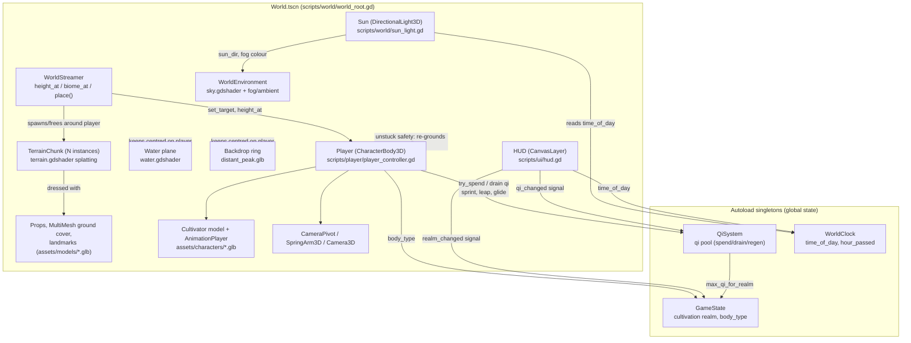
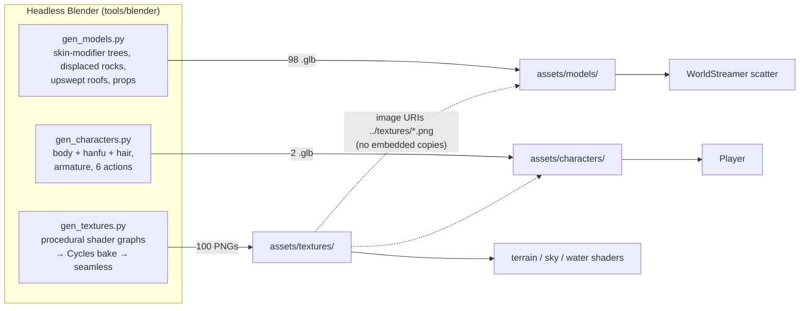

# Xianxiago — Design Notes

A 3D open-world game built in Godot 4, set in a Xianxia cultivation world.
The guiding idea: an ever-expanding world the player explores by cultivating
strength — qi, light-body movement, and (later) combat and sect systems.

## Current milestone: exploration + movement core

No combat, no NPCs yet. The goal of this pass is to prove the open-world
feel: does moving through the world, sprinting, jumping, and gliding feel
good, and does the terrain keep expanding believably as the player explores?

### Controls

| Action | Key |
|---|---|
| Move | WASD |
| Look | Mouse |
| Jump / Qinggong air-leap | Space |
| Sprint | Shift (held) |
| Light-body glide (qinggong) | Ctrl (held, while falling) |
| Switch cultivator (male / female) | C |
| Toggle mouse capture | Esc |

### Architecture



### Systems

- **`GameState`** (autoload, `scripts/systems/game_state.gd`) — tracks the
  player's cultivation realm (Mortal → Qi Condensation → Foundation
  Establishment → Core Formation → Nascent Soul). Each realm raises max qi.
  Nothing advances realms yet (no cultivation/breakthrough mechanic) — this
  is a hook for that system.
- **`QiSystem`** (autoload, `scripts/systems/qi_system.gd`) — the qi
  (internal energy) resource pool. Sprinting, the qinggong air-leap, and
  gliding all draw from it via `try_spend()` / `drain()`. Regenerates after
  a short delay when not being spent. This is the same pool combat
  techniques will use later.
- **`WorldClock`** (autoload, `scripts/systems/world_clock.gd`) — a shared
  day/night clock (`time_of_day`, 0–24, wraps). `sun_light.gd` reads it to
  rotate and recolor the sun; anything gameplay-relevant (spawns, NPC
  schedules) can subscribe to `hour_passed` instead of polling.
- **Player** (`scripts/player/player_controller.gd`, `scenes/player/Player.tscn`)
  — `CharacterBody3D` with camera-relative movement, sprint, jump, and a
  qinggong air-leap + glide combo (press Space mid-air once for a boosted
  leap, hold Ctrl while falling to glide). The visible body is a rigged
  Blender-made cultivator (`assets/characters/cultivator_male.glb` /
  `cultivator_female.glb`, toggled with C) whose `idle` / `walk` / `run` /
  `jump` / `fall` / `glide` animations follow the movement state.
- **Terrain** (`scripts/world/world_streamer.gd`,
  `scripts/world/terrain_chunk.gd`) — the open world is built from square
  chunks generated on demand from a single shared `FastNoiseLite`, so
  neighboring chunks always line up. `WorldStreamer` spawns chunks in a
  ring around the player and frees ones that fall out of range, so the
  playable area keeps expanding as far as the player is willing to walk.
  Heights combine rolling Perlin hills with a low-frequency mountain
  layer. `resources/shaders/terrain.gdshader` splats nine Blender-baked
  texture layers (lush grass, flower meadow, forest floor, dirt, sand,
  rock, triplanar cliff strata, snow + a macro-variation map) by height,
  slope and kilometre-scale noise, so the ground is never one colour.
  Each chunk is dressed from 98 Blender models: biome-aware trees (pine
  forest, cherry grove, bamboo grove, maple woods, meadow), rocks and
  spirit props, MultiMesh grass/flowers/ferns, occasional landmark sets
  (pavilions, pagodas, gates, sect halls) and floating islands.
- **Sky / lighting** (`resources/environment/world_environment.tres`,
  `resources/shaders/sky.gdshader`, `scripts/world/sun_light.gd`) — a
  painted sky shader: azure zenith grading to a warm hazy horizon, rose
  and amber at dawn/dusk, stars and a moon at night, two drifting cloud
  decks and two layers of mountain silhouettes on the horizon, all from
  Blender-baked textures. The sun rises at 06:00, is overhead at noon and
  sets at 18:00 (it previously lit the world from below during the day);
  after dusk the light becomes a cool moon. Fog and ambient light are
  retinted with the time of day. A water plane (`water.gdshader`) fills
  the valleys below `WATER_LEVEL`, and a ring of distant peaks sits beyond
  the streamed terrain.
- **HUD** (`scenes/ui/HUD.tscn`, `scripts/ui/hud.gd`) — realm name, in-game
  clock, and a qi bar bound to `QiSystem`'s signals.

## Blender pipeline

All art is generated by scripts in `tools/blender/`, run with headless
Blender (`blender -b --python <script>`) or the `bpy` wheel
(`pip install bpy==4.5.4` under Python 3.11, then `python3.11 <script>`).
Every generator uses fixed seeds, so re-running it reproduces the same
assets (the bytes can differ by float rounding).



- **`gen_textures.py`** → `assets/textures/` (100 PNGs, 1024², about 0.9 MB
  each on average). Each texture is a node graph (noise, voronoi, wave, brick) baked
  with Cycles, then made tileable with an offset-and-crossfade pass. Normal
  maps are derived from a separately baked height graph. Covers terrain
  layers, architecture (glazed roof tiles, lacquer, stone, marble, bronze,
  gold, celadon), bark, alpha-cut foliage cards, fabrics/skin/hair, sky
  (clouds, stars, mountain panoramas) and water.
- **`gen_models.py`** → `assets/models/` (98 GLBs). Trees grow a
  recursive branch skeleton that the Skin modifier turns into a trunk, with
  crossed leaf cards whose normals point out of the canopy for soft
  lighting; rocks are displaced icospheres; buildings use upswept hip roofs
  with modelled tile corrugations. `--preview DIR` renders a Cycles
  thumbnail of each model.
- **`gen_characters.py`** → `assets/characters/` (male + female). The body
  is a Skin-modifier skeleton, dressed in a lathed robe, bell sleeves,
  sash, boots and per-variant hair and accessories. Each part is
  distance-weighted to a hand-built armature, and the idle, walk, run,
  jump, fall and glide actions are exported as NLA tracks.
- **`xg_common.py` / `xg_mesh.py`**: the node-graph DSL, bake/seamless/
  normal-map helpers, geometry builders, the shared material palette and
  the exporter. The exporter writes glTF-separate, then repacks it as a
  `.glb` whose images point at `../textures/*.png`, so Godot imports each
  texture once (VRAM-compressed, mipmapped) instead of once per model.

Regenerate everything (about 5 minutes on 4 cores):

```sh
python3.11 tools/blender/gen_textures.py
for p in 0 1 2 3; do python3.11 tools/blender/gen_models.py --jobs 4 --part $p & done; wait
python3.11 tools/blender/gen_characters.py
godot --headless --path . --import
```

`tools/.gdignore` keeps Godot from scanning the Python sources.

## Architecture choices worth knowing

- **Chunk streaming instead of one big terrain**: keeps memory/collision
  cost bounded regardless of how far the player walks, and is the
  mechanism that satisfies "expand the map as much as I can" — there's no
  hardcoded world boundary.
- **Autoload singletons for cross-cutting state** (`GameState`, `QiSystem`,
  `WorldClock`) rather than passing references everywhere — these are
  genuinely global (one clock, one qi pool, one cultivation state) so a
  singleton is the right call, not premature abstraction.
- **Shared textures referenced by URI, not embedded**: 100 GLBs embedding
  their own copies would multiply import time and VRAM. Pointing glTF
  images at `res://assets/textures` means one imported texture per file.
- **Terrain winding is clockwise from above**: Godot treats clockwise
  triangles as front faces. The original counter-clockwise terrain was
  back-face culled (see-through ground) and its trimesh collider faced
  down, so the player sank into it and wedged, the "stuck on load" bug.
  `world_root.gd` also re-grounds the player if they ever end up below
  the surface.
