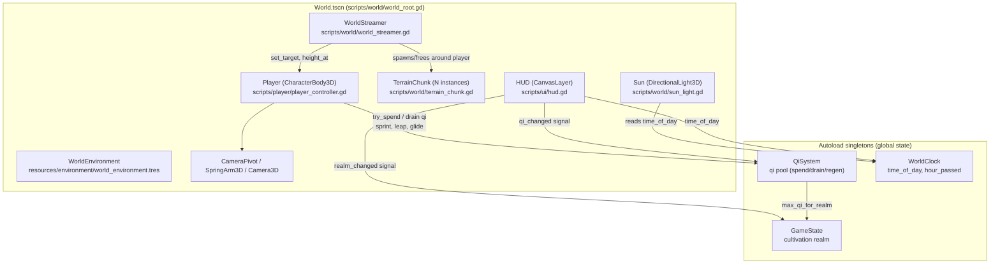

# Xianxiago — Design Notes

A 3D open-world game built in Godot 4, set in a Xianxia cultivation world.
The guiding idea: an ever-expanding world the player explores by cultivating
strength — qi, light-body movement, and (later) combat and sect systems.

## Current milestone: exploration + movement core

No combat, no NPCs yet. The goal of this pass is to prove the open-world
feel: does moving through the world, sprinting, jumping, and gliding feel
good, and does the terrain keep expanding believably as the player explores?

### Controls

| Action | Key |
|---|---|
| Move | WASD |
| Look | Mouse |
| Jump / Qinggong air-leap | Space |
| Sprint | Shift (held) |
| Light-body glide (qinggong) | Ctrl (held, while falling) |
| Toggle mouse capture | Esc |

### Architecture



### Systems

- **`GameState`** (autoload, `scripts/systems/game_state.gd`) — tracks the
  player's cultivation realm (Mortal → Qi Condensation → Foundation
  Establishment → Core Formation → Nascent Soul). Each realm raises max qi.
  Nothing advances realms yet (no cultivation/breakthrough mechanic) — this
  is a hook for that system.
- **`QiSystem`** (autoload, `scripts/systems/qi_system.gd`) — the qi
  (internal energy) resource pool. Sprinting, the qinggong air-leap, and
  gliding all draw from it via `try_spend()` / `drain()`. Regenerates after
  a short delay when not being spent. This is the same pool combat
  techniques will use later.
- **`WorldClock`** (autoload, `scripts/systems/world_clock.gd`) — a shared
  day/night clock (`time_of_day`, 0–24, wraps). `sun_light.gd` reads it to
  rotate and recolor the sun; anything gameplay-relevant (spawns, NPC
  schedules) can subscribe to `hour_passed` instead of polling.
- **Player** (`scripts/player/player_controller.gd`, `scenes/player/Player.tscn`)
  — `CharacterBody3D` with camera-relative movement, sprint, jump, and a
  qinggong air-leap + glide combo (press Space mid-air once for a boosted
  leap, hold Ctrl while falling to glide). Placeholder capsule+sphere visual
  — swap for a real rigged character later.
- **Terrain** (`scripts/world/world_streamer.gd`,
  `scripts/world/terrain_chunk.gd`) — the open world is built from square
  chunks generated on demand from a single shared `FastNoiseLite`, so
  neighboring chunks always line up. `WorldStreamer` spawns chunks in a
  ring around the player and frees ones that fall out of range, so the
  playable area keeps expanding as far as the player is willing to walk.
  Terrain is colored per-vertex by height (grass → rock → snow) instead of
  textured, so it needs no external art to look reasonable.
- **Sky / lighting** (`resources/environment/world_environment.tres`,
  `scripts/world/sun_light.gd`) — a procedural sky (jade-blue zenith,
  warm horizon) with light fog for a misty-mountain read, plus a sun that
  rotates and shifts color/intensity with `WorldClock`.
- **HUD** (`scenes/ui/HUD.tscn`, `scripts/ui/hud.gd`) — realm name, in-game
  clock, and a qi bar bound to `QiSystem`'s signals.

## Blender pipeline

No hand-sculpted art yet — the world still uses procedurally-generated,
vertex-colored terrain and primitive-mesh placeholders so gameplay systems
stay real and testable without blocking on art. But headless Blender is
confirmed working in this environment:

```sh
blender -b --python generate_asset.py
```

(`-b` = background/no GUI). This environment's Blender needs
`python3-numpy` installed for the glTF exporter add-on to import; without
it, `bpy.ops.export_scene.gltf(...)` fails with `ModuleNotFoundError:
numpy`. Draco mesh compression isn't available (`libextern_draco.so`
missing) — harmless, just don't set `export_draco_mesh_compression_enable`.

So Blender-made assets can be generated by *scripting* Blender's Python API
(`bpy`) rather than using the GUI interactively. When it's time to bring in
real assets (mountains, sect architecture, cultivator characters, spirit
beasts), the plan is:

1. Write/generate the mesh in Blender via a `bpy` script (or import an
   existing `.blend` authored elsewhere) and export as `.glb`/`.gltf` with
   `bpy.ops.export_scene.gltf(filepath=..., export_format='GLB')`.
2. Drop exported files under a new `assets/` (or `art/`) folder — keep
   `.blend` sources out of git via `.blend1`/`.blend2` ignores already set
   up, or use Git LFS if you want to version the `.blend` files themselves.
3. Swap the placeholder capsule/sphere player mesh and the flat
   `StandardMaterial3D` terrain material for the real assets — the scripts
   don't care what mesh is attached, so this is a drop-in scene edit, not a
   code change.

## Architecture choices worth knowing

- **Chunk streaming instead of one big terrain**: keeps memory/collision
  cost bounded regardless of how far the player walks, and is the
  mechanism that satisfies "expand the map as much as I can" — there's no
  hardcoded world boundary.
- **Autoload singletons for cross-cutting state** (`GameState`, `QiSystem`,
  `WorldClock`) rather than passing references everywhere — these are
  genuinely global (one clock, one qi pool, one cultivation state) so a
  singleton is the right call, not premature abstraction.
- **Vertex-colored terrain, no textures**: avoids needing art assets before
  the movement/terrain systems can be evaluated at all.
